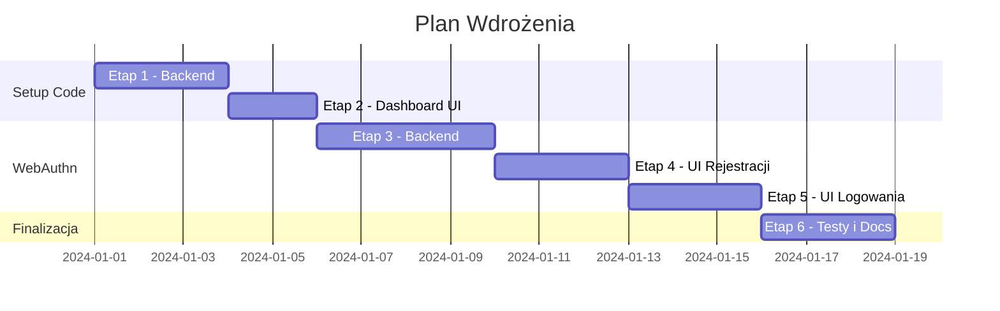

# Plan Migracji: Centrum Logowania App

> **Cel**: Uproszczenie integracji nowych aplikacji (Setup Code) + dodanie logowania kluczem fizycznym (WebAuthn/Passkeys)

---

## Przegląd Etapów

| Etap | Nazwa                            | Szacowany czas | Zależności |
| ---- | -------------------------------- | -------------- | ---------- |
| 1    | Setup Code - Backend             | ✅ Gotowe      | -          |
| 2    | Setup Code - Dashboard UI        | ✅ Gotowe      | Etap 1     |
| 3    | WebAuthn - Schemat i Backend     | 3-4h           | -          |
| 4    | WebAuthn - UI Rejestracji Klucza | 2-3h           | Etap 3     |
| 5    | WebAuthn - UI Logowania          | 2-3h           | Etap 4     |
| 6    | Testy i Dokumentacja             | 2-3h           | Wszystkie  |

**Łączny szacowany czas**: 13-18h

---

## Etap 1: Setup Code - Backend

### 1.1 Nowa tabela w schemacie

**Plik**: `src/lib/db/schema.ts`

```typescript
// Setup Codes dla łatwej rejestracji nowych aplikacji
export const projectSetupCodes = mySchema.table('project_setup_code', {
  id: uuid('id').defaultRandom().primaryKey(),
  projectId: uuid('project_id')
    .notNull()
    .references(() => projects.id, { onDelete: 'cascade' }),
  code: text('code').notNull().unique(), // np. "setup_abc123xyz"
  expiresAt: timestamp('expires_at', { mode: 'date' }).notNull(),
  usedAt: timestamp('used_at', { mode: 'date' }), // null = nieużyty
  usedByIp: text('used_by_ip'), // IP które użyło kodu
  createdAt: timestamp('created_at').defaultNow(),
});
```

### 1.2 Migracja bazy danych

```bash
npx drizzle-kit generate
npx drizzle-kit migrate
```

### 1.3 Nowy endpoint: Generowanie Setup Code

**Plik**: `src/app/api/v1/project/[projectId]/setup-code/route.ts`

```typescript
// POST - Generuje nowy setup code (tylko właściciel projektu)
// GET - Lista aktywnych setup codes
// DELETE - Unieważnia setup code
```

**Logika**:

- Sprawdź czy user jest właścicielem projektu
- Wygeneruj unikalny kod: `setup_${crypto.randomBytes(16).toString('hex')}`
- Ustaw wygaśnięcie: 24h
- Zapisz w `projectSetupCodes`
- Zwróć kod

### 1.4 Nowy endpoint: Claim Setup Code

**Plik**: `src/app/api/v1/projects/claim/route.ts`

```typescript
// POST /api/v1/projects/claim
// Body: { setupCode: "setup_abc123" }
// Response: { apiKey, slug, centerUrl, projectName }
```

**Logika**:

1. Znajdź setup code w bazie
2. Sprawdź czy nie wygasł i nie użyty
3. Oznacz jako użyty (`usedAt`, `usedByIp`)
4. Zwróć konfigurację projektu (apiKey, slug, centerUrl)

### 1.5 Checklist Etapu 1

- [x] Dodać tabelę `projectSetupCodes` do schema.ts
- [x] Uruchomić migrację Drizzle (użyto `db:push`)
- [x] Utworzyć endpoint `POST /api/v1/project/[projectId]/setup-code`
- [x] Utworzyć endpoint `GET /api/v1/project/[projectId]/setup-code`
- [x] Utworzyć endpoint `DELETE /api/v1/project/[projectId]/setup-code/[codeId]`
- [x] Utworzyć endpoint `POST /api/v1/projects/claim`
- [x] Dodać testy jednostkowe dla endpointów
- [x] Zaktualizować `API_DOCS.md`

> **Note**: Wdrożono 27.12.2024. Dodano również skrypt demo `scripts/setup-with-code.mjs`.

---

## Etap 2: Setup Code - Dashboard UI

### 2.1 Komponent zarządzania Setup Codes

**Plik**: `src/components/dashboard/SetupCodeManager.tsx`

**Funkcjonalności**:

- Lista aktywnych setup codes (z czasem do wygaśnięcia)
- Przycisk "Generuj nowy kod"
- Przycisk kopiowania kodu do schowka
- Przycisk unieważnienia kodu

### 2.2 Integracja z dashboardem projektu

**Plik**: `src/app/dashboard/project/[id]/page.tsx` (lub podobny)

- Dodać sekcję "Setup Codes" z komponentem `SetupCodeManager`
- Wyświetlić instrukcję dla użytkownika

### 2.3 Checklist Etapu 2

- [x] Utworzyć komponent `SetupCodeManager`
- [x] Dodać Server Action do generowania/usuwania kodów (zrobione przez API)
- [x] Zintegrować z dashboardem projektu
- [x] Dodać instrukcję użycia dla developerów (wbudowana w modal + Setup Wizard w demo)
- [x] Testy E2E dla UI (Wdrożono interaktywny Setup Wizard w demo-apps)

> **Note**: Wdrożono 27.12.2024. Dodano `setup-wizard.js` do aplikacji demo (Blog, Shop), co pozwala na łatwe testowanie całego flow setup code bez użycia CLI. Logi serwera są teraz ukryte w trybie produkcyjnym.

---

## Etap 3: WebAuthn - Schemat i Backend

### 3.1 Instalacja zależności

```bash
npm install @simplewebauthn/server @simplewebauthn/browser
npm install -D @simplewebauthn/types
```

### 3.2 Nowa tabela w schemacie

**Plik**: `src/lib/db/schema.ts`

```typescript
// Passkeys / WebAuthn Credentials
export const passkeys = mySchema.table('passkey', {
  id: uuid('id').defaultRandom().primaryKey(),
  userId: uuid('user_id')
    .notNull()
    .references(() => users.id, { onDelete: 'cascade' }),

  // WebAuthn credential data
  credentialId: text('credential_id').notNull().unique(), // Base64URL
  publicKey: text('public_key').notNull(), // Base64URL encoded
  counter: integer('counter').notNull().default(0),

  // Metadata
  deviceName: text('device_name'), // np. "YubiKey 5", "MacBook Touch ID"
  transports: text('transports'), // JSON array: ["usb", "nfc", "ble", "internal"]

  // Audit
  lastUsedAt: timestamp('last_used_at', { mode: 'date' }),
  createdAt: timestamp('created_at').defaultNow(),
});

// Challenge storage (krótkotrwałe, do weryfikacji)
export const webauthnChallenges = mySchema.table('webauthn_challenge', {
  id: uuid('id').defaultRandom().primaryKey(),
  challenge: text('challenge').notNull(),
  userId: uuid('user_id').references(() => users.id, { onDelete: 'cascade' }), // null dla rejestracji
  type: text('type').notNull(), // 'registration' | 'authentication'
  expiresAt: timestamp('expires_at', { mode: 'date' }).notNull(),
  createdAt: timestamp('created_at').defaultNow(),
});
```

### 3.3 Konfiguracja WebAuthn

**Plik**: `src/lib/webauthn/config.ts`

```typescript
export const webauthnConfig = {
  rpName: 'Centrum Logowania',
  rpID: process.env.WEBAUTHN_RP_ID || 'localhost', // domena
  origin: process.env.WEBAUTHN_ORIGIN || 'http://localhost:3000',
  challengeTimeout: 60000, // 60 sekund
};
```

### 3.4 Endpointy rejestracji Passkey

**Plik**: `src/app/api/v1/webauthn/register/options/route.ts`

```typescript
// POST - Generuje opcje rejestracji (challenge)
// Wymaga zalogowanego użytkownika
```

**Plik**: `src/app/api/v1/webauthn/register/verify/route.ts`

```typescript
// POST - Weryfikuje rejestrację i zapisuje passkey
// Body: { credential: AttestationCredential }
```

### 3.5 Endpointy logowania Passkey

**Plik**: `src/app/api/v1/webauthn/login/options/route.ts`

```typescript
// POST - Generuje opcje logowania (challenge)
// Body: { email?: string } - opcjonalnie dla usernameless
```

**Plik**: `src/app/api/v1/webauthn/login/verify/route.ts`

```typescript
// POST - Weryfikuje logowanie
// Body: { credential: AssertionCredential }
// Response: Tworzy sesję (jak Google OAuth)
```

### 3.6 Checklist Etapu 3

- [ ] Zainstalować `@simplewebauthn/server` i `@simplewebauthn/browser`
- [ ] Dodać tabele `passkeys` i `webauthnChallenges` do schema.ts
- [ ] Uruchomić migrację Drizzle
- [ ] Utworzyć `src/lib/webauthn/config.ts`
- [ ] Utworzyć endpoint `POST /api/v1/webauthn/register/options`
- [ ] Utworzyć endpoint `POST /api/v1/webauthn/register/verify`
- [ ] Utworzyć endpoint `POST /api/v1/webauthn/login/options`
- [ ] Utworzyć endpoint `POST /api/v1/webauthn/login/verify`
- [ ] Dodać zmienne środowiskowe: `WEBAUTHN_RP_ID`, `WEBAUTHN_ORIGIN`
- [ ] Testy jednostkowe

---

## Etap 4: WebAuthn - UI Rejestracji Klucza

### 4.1 Strona zarządzania kluczami

**Plik**: `src/app/dashboard/security/passkeys/page.tsx`

**Funkcjonalności**:

- Lista zarejestrowanych kluczy (nazwa, data dodania, ostatnie użycie)
- Przycisk "Dodaj nowy klucz"
- Modal/dialog z instrukcją (włóż klucz, dotknij)
- Możliwość usunięcia klucza
- Możliwość zmiany nazwy klucza

### 4.2 Komponent rejestracji

**Plik**: `src/components/webauthn/PasskeyRegistration.tsx`

```typescript
// Używa @simplewebauthn/browser
// startRegistration() -> POST /register/options -> navigator.credentials.create() -> POST /register/verify
```

### 4.3 Checklist Etapu 4

- [ ] Utworzyć stronę `/dashboard/security/passkeys`
- [ ] Utworzyć komponent `PasskeyRegistration`
- [ ] Utworzyć komponent `PasskeyList`
- [ ] Dodać link w nawigacji dashboardu
- [ ] Obsługa błędów (brak wsparcia przeglądarki, timeout, itp.)
- [ ] Testy E2E

---

## Etap 5: WebAuthn - UI Logowania

### 5.1 Modyfikacja strony logowania

**Plik**: `src/app/page.tsx` (strona główna / logowanie)

**Zmiany**:

- Dodać przycisk "Zaloguj kluczem" obok przycisku Google
- Lub: "Inne metody logowania" → rozwijana lista

### 5.2 Komponent logowania kluczem

**Plik**: `src/components/webauthn/PasskeyLogin.tsx`

```typescript
// startAuthentication() -> POST /login/options -> navigator.credentials.get() -> POST /login/verify
```

### 5.3 Integracja z flow OAuth2

Po udanym logowaniu kluczem:

1. Tworzona jest sesja NextAuth (jak przy Google)
2. Jeśli user przyszedł z `/authorize` → kontynuuj flow OAuth2
3. Przekierowanie na dashboard lub do aplikacji klienckiej

### 5.4 Checklist Etapu 5

- [ ] Utworzyć komponent `PasskeyLogin`
- [ ] Zmodyfikować stronę logowania (dodać przycisk)
- [ ] Obsługa conditional UI (discoverable credentials)
- [ ] Integracja z flow OAuth2 (authorize → callback)
- [ ] Fallback gdy brak kluczy lub błąd
- [ ] Testy E2E

---

## Etap 6: Testy i Dokumentacja

### 6.1 Testy

| Typ         | Co testować                                    |
| ----------- | ---------------------------------------------- |
| Unit        | Generowanie/walidacja setup codes              |
| Unit        | WebAuthn challenge generation/verification     |
| Integration | Claim setup code → otrzymanie konfiguracji     |
| Integration | Rejestracja passkey → logowanie passkey        |
| E2E         | Pełny flow: nowa app → setup code → działa SSO |
| E2E         | Logowanie kluczem → autoryzacja w FA           |

### 6.2 Dokumentacja

- [ ] Zaktualizować `API_DOCS.md` (nowe endpointy)
- [ ] Zaktualizować `README.md` (nowe funkcje)
- [ ] Utworzyć `SETUP_GUIDE.md` dla developerów nowych aplikacji
- [ ] Dodać instrukcję konfiguracji WebAuthn w produkcji

### 6.3 Zmienne środowiskowe

Dodać do `.env.example`:

```env
# WebAuthn / Passkeys
WEBAUTHN_RP_ID=centrum-logowania.app
WEBAUTHN_ORIGIN=https://centrum-logowania.app
```

### 6.4 Checklist Etapu 6

- [ ] Testy jednostkowe dla wszystkich nowych funkcji
- [ ] Testy E2E dla flow setup code
- [ ] Testy E2E dla flow WebAuthn
- [ ] Zaktualizować `API_DOCS.md`
- [ ] Zaktualizować `README.md`
- [ ] Utworzyć `SETUP_GUIDE.md`
- [ ] Dodać zmienne do `.env.example`
- [ ] Code review

---

## Kolejność Wdrażania (Rekomendacja)



**Zalecenie**: Można wdrożyć Setup Code (Etapy 1-2) niezależnie od WebAuthn (Etapy 3-5). To pozwala szybciej udostępnić uproszczoną integrację, a klucze fizyczne dodać później.

---

## Dodatkowe Uwagi

### Kompatybilność z istniejącym kodem

- ✅ Obecny flow Google OAuth pozostaje bez zmian
- ✅ Istniejące aplikacje (FA) działają bez modyfikacji
- ✅ Setup Code jest opcjonalny (można nadal używać .env)
- ✅ Passkey jest dodatkową metodą (nie zastępuje Google)

### Bezpieczeństwo WebAuthn

- Passkeys są odporne na phishing (bound to origin)
- Prywatny klucz nigdy nie opuszcza urządzenia
- Counter zapobiega atakom replay
- Challenge jest jednorazowy i krótkotrwały

### Wsparcie przeglądarek

WebAuthn jest wspierany przez:

- Chrome 67+
- Firefox 60+
- Safari 13+
- Edge 18+

Należy dodać fallback dla starszych przeglądarek.
